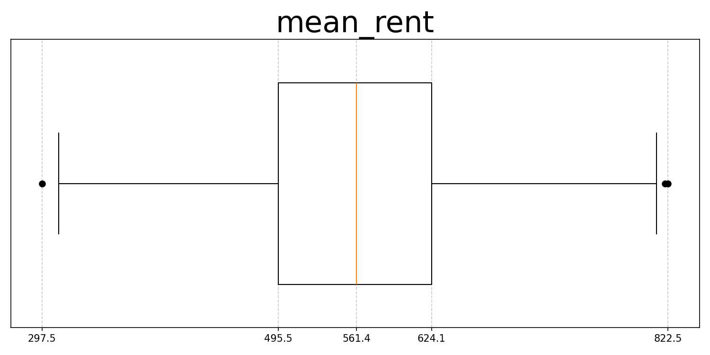
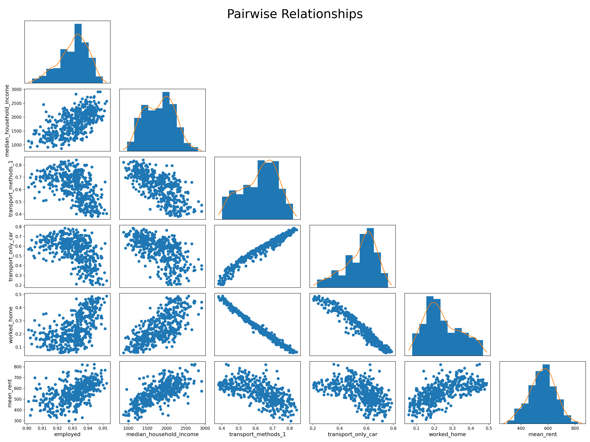
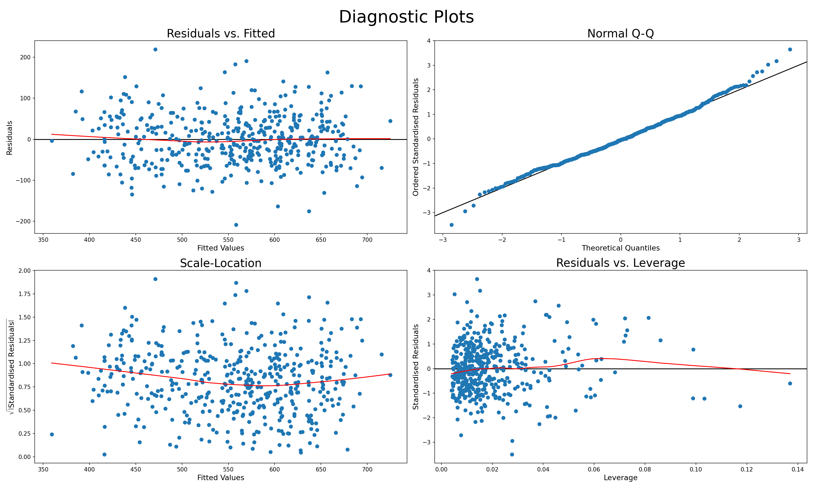

# Analysis of Property Rent around Victoria, Australia

This project examines the relationship between rental prices and various factors
around Victoria, Australia.

## Scraping

On `2024-07-23` the scraper collected `14,393` rental properties from
[Domain.com.au](https://www.domain.com.au). At the time of scraping and as of
`2024-08-09` the scraper complied with Domain's
[`robots.txt`](https://www.domain.com.au/robots.txt). A minimum delay of `1`
second between each request to Domain was also made to reduce the load on their
servers.

For each property the raw listed rent price and location was collected; needing
to be cleaned before usage.

## Cleaning

For each scraped property the weekly rent, latitude, and longitude were
extracted from the raw data. `431` properties with missing or incompatible data,
such as listing: `Contact Agent` for the rent, were dropped. This left `13,962`
properties.

## Preprocessing

Each property was assigned to an appropriate Victorian SA2 zone based on their
location. `5` properties were dropped for being outside all Victorian SA2 zones.
`993` entries were also dropped as outliers, including listings such as a car
space for `$50`, which are not actual properties. The mean rent was then
aggregated for each SA2 zone using the remaining properties.

Support datasets for income, transport, and work hours were joined with the
mean rent data by their SA2 zone. Relevant features from these support datasets
were selected, wrangled and standardised as listed below. `59` SA2 zones with
missing values or clear outliers were also dropped.

The final dataset includes complete data for `463` of the `522` Victorian SA2
zones, with the following features:

Dependent variable:

* `mean_rent`

Factors:

* `employed` (worked more than `1` hour a month)
* `median_household_income`
* `transport_methods_1` (only used `1` mode of transport to get to work)
* `transport_only_car` (only used a car to get to work)
* `worked_home`

These factors were selected by going back-and-forth with the analysis, using
metrics such as Pearson's correlation.

## Analysis

Looking at the boxplot the majority of the mean rent prices are around `$60`
either side of `$560`. Using the collated features above we want to find a model
that can accurately predict within this range.

Examining the pairwise relationships of features there appears to be
interactions between some of them, in addition a linear correlation with the
mean rent.

Although upon first inspection it appears some features have slight non-linear
relationships with the mean rent, trying various transformations did not
significantly improve the model.

Because of this, initially a linear model with two-way interactions between all
terms was fit, then reduced the model systematically using both backwards
stepwise selection and features' p-values. This resulted in a model with `8`
parameters (excluding the intercept), as listed below:

Main effects:

* `employed`
* `median_household_income`
* `transport_methods_1`
* `transport_only_car`
* `worked_home`

Interactions effects:

* `employed : transport_methods_1`
* `employed : worked_home`
* `median_household_income : transport_methods_1`

Remaining effects in the final model indicate they cannot be found to be
non-significant, suggesting they have a relationship with the mean rent.
Additionally, the final interactions match the apparent relationships above.

The diagnostic plots of the final model indicate a reasonable fit to the data,
as explained below:

* __Residuals vs. Fitted__: Values appear evenly distributed around the axis
                            with no clear pattern.
* __Normal Q-Q__: Values appear reasonably close to the line, with no
                  significant deviations in the tails.
* __Scale-Location__: Values appear evenly distributed around the axis with no
                      clear pattern.
* __Residuals vs. Leverage__: No clear outliers or instances with significant
                              influence.

The likelihood ratio test also suggests this model is adequate.

Using leave-one-out cross-validation to evaluate the model's generalisation to
unseen data, it was found that the model has an average Root Mean Squared Error
(RMSE) of `48.23`. This indicates that the model can generally predict within
`$49` of the actual rent price for an SA2 zone, which is within the `$60` target
stated above.

## Conclusion

As found above, the `5` factors do appear to be related to rental prices.
Bringing together these factors with the mean rent provides an effective method
to predict the rental prices.

## Invoking Instructions

This projects works with `Python 3.12` and a `requirements.txt` has been
provided for the necessary libraries.

The outputs of each script has been provided, so each script can be run on its
own, however, to follow the project flow run the scripts in the order listed
below:

1. `scraping.py`
    * May not work if Domain changes their website - works as of `2024-08-09`
    * Output is time sensitive - skip to get the same results as the analysis
2. `cleaning.py`
3. `preprocessing.py`
4. `analysis.py`

Run each script with `python3.12 <script>`.

## Data Sovereignty

All datasets except the rental properties were collected from
[Spatial Urban Data Observatory (SUDO)](https://sudo.eresearch.unimelb.edu.au/)
provided by [Australian Bureau of Statistics (ABS)](https://www.abs.gov.au/)
from the `2021` census.

Full datasets are provided, however, only select attributes were used.

### Rental Properties

Scraped from [Domain.com.au](https://www.domain.com.au) on `2024-07-23`

### Victorian SA2 Zones

Accessed from [SUDO](https://sudo.eresearch.unimelb.edu.au/) on `2024-07-27`

### Income

[Government of the Commonwealth of Australia - Australian Bureau of Statistics](
https://www.abs.gov.au/), (`2022`): SA2-G02 Selected Medians and Averages;
accessed from [SUDO](https://sudo.eresearch.unimelb.edu.au/) on `2024-07-25`

### Transport

[Government of the Commonwealth of Australia - Australian Bureau of Statistics](
https://www.abs.gov.au/), (`2022`): SA2-G62 Methods of Travel to Work by Sex;
accessed from [SUDO](https://sudo.eresearch.unimelb.edu.au/) on `2024-07-25`

### Work Hours

[Government of the Commonwealth of Australia - Australian Bureau of Statistics](
https://www.abs.gov.au/), (`2022`): SA2-G61B Occupation by Hours Worked by Sex;
accessed from [SUDO](https://sudo.eresearch.unimelb.edu.au/) on `2024-07-26`
